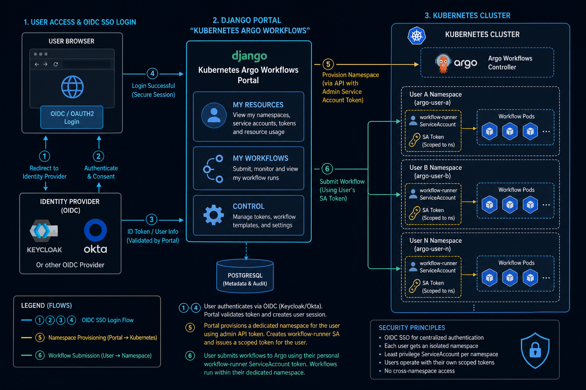

# Kubernetes Argo Workflows

**Release `0.0.1`** · dev/test only - feel free to send pull requests!

A web portal for **multi-tenant Argo Workflows** on Kubernetes. Users access the platform through **OpenID Connect (OIDC) single sign-on (SSO)** — credentials stay with your identity provider, not in the application. The portal provisions isolated cluster resources per user and lets them author and submit **Argo Workflow** manifests from the browser.

> **Development and testing only.** Kubernetes Argo Workflows is in active development. It uses SQLite, stores cluster tokens in the database, and ships with dev-oriented defaults (e.g. `DJANGO_DEBUG=true`, optional TLS verification against Kubernetes). **Do not deploy this to production** without a full security review, hardened storage, and production-grade identity and secrets management.

## Tested cluster stack

Versions used for development and validation of **release `0.0.1`**:

| Component | Version |
|-----------|---------|
| **Kubernetes** | `1.34.5` |
| **Argo Workflows** (workflow controller) | `v3.7.14` — `quay.io/argoproj/workflow-controller:v3.7.14` |

Other Kubernetes or Argo versions may work but are not documented for this release. Install Argo Workflows before registering a cluster (see [Requirements](#requirements)).

## At a glance



| Layer | Role |
|-------|------|
| **Identity (OIDC SSO)** | Users sign in through your IdP (e.g. Keycloak, Okta, Entra ID); no passwords stored in the portal |
| **Portal (Django)** | Provisions per-user resources, stores workflow YAML, submits to the cluster API |
| **Kubernetes + Argo** | Runs workflows in isolated user namespaces |

Visual walkthrough of each screen: **[`docs/PLATFORM_GUIDE.md`](docs/PLATFORM_GUIDE.md)**.

## Secure authentication (OIDC SSO)

The platform does **not** manage user passwords. Every sign-in is delegated to an **OIDC-compatible identity provider** using the industry-standard authorization code flow:

1. User clicks **Sign in** on the home page.
2. The browser redirects to your IdP’s login page (SSO session may already apply).
3. After successful authentication, the IdP returns tokens to the portal.
4. The portal validates tokens, creates or updates a local user record, and opens a Django session.

This gives you **centralized identity**: disable a user in the IdP and they can no longer access the portal; enforce MFA, password policies, and audit login at the IdP.

**Supported identity providers** (any OIDC-compliant server with a confidential client):

| Provider | Typical use |
|----------|-------------|
| **[Keycloak](https://www.keycloak.org/)** | Self-hosted OSS; used in this project’s dev setup and Docker Compose profile |
| **[Okta](https://www.okta.com/)** | Enterprise SSO |
| **[Microsoft Entra ID](https://www.microsoft.com/en-us/security/business/identity-access/microsoft-entra-id)** (Azure AD) | Microsoft 365 / Azure organizations |
| **[Google Cloud Identity](https://cloud.google.com/identity)** | Google Workspace |
| **[Auth0](https://auth0.com/)** | Managed identity platform |
| **Other OIDC providers** | Configure `KEYCLOAK_URL`, realm, client ID, and secret to match your issuer |

Group membership from the IdP (e.g. Keycloak **Groups**, Entra **groups** claim) drives **admin access** to the Control panel when `KEYCLOAK_SYNC_DJANGO_GROUPS=true`. See [Keycloak setup](#keycloak-setup) for a full Keycloak example; other providers need equivalent OIDC client settings and a `groups` (or custom) claim in userinfo or the ID token.

## What Kubernetes Argo Workflows provides

For each authenticated user on a registered cluster, the portal can automatically provision:

| Resource | Details |
|----------|---------|
| **Personal namespace** | A dedicated Kubernetes namespace derived from the user’s OIDC `sub` claim (sanitized to a valid name). Users do not share namespaces. |
| **Service account** | `workflow-runner` in that namespace — the identity workflows run under. |
| **Argo Workflows RBAC** | Namespaced Role `argo-workflows-role` and RoleBinding granting permissions to submit workflows, read templates, report task results, and patch pods (Argo emissary executor). |
| **Personal bearer token** | A Kubernetes service account token for `workflow-runner`, stored by the portal and used to submit workflows to the cluster API on behalf of the user. |

**Additional capabilities**

- **My workflows** — create, edit, and submit Argo Workflow YAML against the user’s namespace.
- **My resources** — request or verify cluster resources; optional reveal of the personal token (`RESOURCE_PROVISION_SHOW_USER_TOKEN`).
- **Control panel** (IdP `admin` group, e.g. Keycloak group `admin`) — register clusters, browse namespaces, inspect user provisions and OIDC profiles.
- **Cluster explorer** — live namespace listing via the Kubernetes API.

Isolation is **namespace-scoped**: each user gets their own namespace and token; the portal does not replace cluster-wide security policies or network policies you may still want to apply.

## Requirements

### Application (to run Kubernetes Argo Workflows)

| Requirement | Notes |
|-------------|--------|
| **Python** + [uv](https://docs.astral.sh/uv/) | See `pyproject.toml` for version |
| **OIDC identity provider** | e.g. Keycloak, Okta, Entra ID, Auth0 — confidential OIDC client, groups in userinfo or ID token (see [Secure authentication](#secure-authentication-oidc-sso) and [Keycloak setup](#keycloak-setup)) |
| **SQLite** | Default database; suitable for dev/test only |
| **Network** | The portal must reach the IdP (browser redirects + server-side token/userinfo) and each registered Kubernetes API server |

Optional: **Docker** and **Docker Compose** for local dev (see [Docker Compose](#docker-compose-development)).

### Kubernetes cluster (for workflow users)

| Requirement | Notes |
|-------------|--------|
| **Kubernetes cluster** | Any distribution with a reachable API server |
| **Argo Workflows** | **Required** for users to run workflows. Install the [Argo Workflows controller](https://argo-workflows.readthedocs.io/en/latest/quick-start/) in the cluster (or a namespace where workflows will run). The portal submits `Workflow` objects to the API; it does not install Argo for you. |
| **API connectivity** | The portal process must reach the API URL you register (e.g. `https://host.docker.internal:6443` when the app runs in Docker on the host network) |
| **Bootstrap RBAC** | Apply [`k8s/cluster-bootstrap/`](k8s/cluster-bootstrap/) once per cluster (cluster-admin) to create the three portal service accounts and tokens |
| **Service account tokens** | Cluster must populate `kubernetes.io/service-account-token` Secrets (legacy token controller or equivalent); the portal reads user tokens from these Secrets |
| **TLS / CA** | Optional PEM CA on the cluster record for verified TLS; without it, the portal uses `verify_ssl=False` (dev/self-signed only) |

### Before users can request resources

1. Argo Workflows is running on the cluster.
2. Bootstrap manifests are applied and tokens are registered in the portal.
3. An admin has added the cluster under **Control → Clusters** with all three bearer tokens.
4. The cluster is marked **active**.

See [Preparing a Kubernetes cluster](#preparing-a-kubernetes-cluster) for the full setup flow.

## Stack

- **Python** managed with [uv](https://docs.astral.sh/uv/)
- **Django 6** for the web UI
- **mozilla-django-oidc** for OIDC SSO (Keycloak is the documented dev example)
- **SQLite** for local user/profile storage

## Quick start

### 1. Install dependencies

```bash
uv sync
```

### 2. Configure environment

```bash
cp .env.example .env
```

Edit `.env` with your Keycloak realm and client credentials.

### 3. Run migrations

```bash
uv run python manage.py migrate
```

### 4. Start the development server

```bash
uv run python manage.py runserver
```

Open [http://127.0.0.1:8000](http://127.0.0.1:8000).

## Docker Compose (development)

Run the Django app in Docker. Keycloak is **optional** — use your existing Keycloak on the host, or start a bundled one with Compose.

### Option A — External Keycloak on localhost (default)

If Keycloak is already running on your machine (e.g. `http://localhost:8080`):

```bash
cp .env.docker.example .env
# Edit .env: set OIDC_RP_CLIENT_SECRET to match your Keycloak client
docker compose up --build
```

Only the **web** service starts. Django reaches host Keycloak via `host.docker.internal:8080`.

Ensure your Keycloak client allows redirect URI `http://localhost:8000/oidc/callback/`.

### Option B — Bundled Keycloak in Docker Compose

To start Django **and** Keycloak (+ Postgres) together, enable the `keycloak` profile.

**In `.env`** (recommended — persists the choice):

```env
COMPOSE_PROFILES=keycloak
KEYCLOAK_INTERNAL_URL=http://keycloak:8080
OIDC_RP_CLIENT_SECRET=awf-web-secret
```

Then:

```bash
docker compose up --build
```

**Or on the command line** (one-off, without editing `.env`):

```bash
KEYCLOAK_INTERNAL_URL=http://keycloak:8080 \
OIDC_RP_CLIENT_SECRET=awf-web-secret \
docker compose --profile keycloak up --build
```

| Service | URL | When |
|---------|-----|------|
| Web app | [http://localhost:8000](http://localhost:8000) | Always |
| Keycloak | [http://localhost:8080](http://localhost:8080) | Only with `--profile keycloak` |

Bundled Keycloak imports realm **`awf`** with client **`awf-web`** (secret `awf-web-secret`) and test users:

| User | Password | Groups |
|------|----------|--------|
| `admin` | `admin` | `admin` |
| `user` | `user` | — |

Useful commands:

```bash
docker compose up --build                        # web only (external Keycloak)
docker compose --profile keycloak up --build     # web + Keycloak
docker compose down                              # stop services
docker compose logs -f web                       # follow Django logs
docker compose exec web uv run python manage.py shell
```

**Notes**

- **Where to choose:** set `COMPOSE_PROFILES=keycloak` in `.env`, or pass `--profile keycloak` to `docker compose up`.
- With external Keycloak, set `KEYCLOAK_INTERNAL_URL=http://host.docker.internal:8080` (default in `.env.docker.example`).
- With bundled Keycloak, set `KEYCLOAK_INTERNAL_URL=http://keycloak:8080`.
- `KEYCLOAK_PUBLIC_URL` is always the browser-facing URL (`http://localhost:8080`).
- If login fails at `/oidc/callback/` with userinfo **401**, disable **Always use lightweight access token** on client `awf-web` and ensure the groups mapper adds claims to the **ID token**.
- SQLite data is stored in the Docker volume `app-data` at `/data/db.sqlite3`.
- Kubernetes API URLs in the admin panel must be reachable from inside Docker (e.g. `https://host.docker.internal:6443`).

You can still run locally with `uv` without Docker; see **Quick start** above.

## Keycloak setup (example OIDC provider)

The dev and Docker Compose flows use **Keycloak** as the OIDC provider. Other IdPs work with the same pattern: set issuer URLs and client credentials in `.env`.

Create a client in your Keycloak realm with these settings:

| Setting | Value |
|---------|-------|
| Client type | OpenID Connect |
| Client ID | `awf-web` (or match `OIDC_RP_CLIENT_ID`) |
| Client authentication | On (confidential client) |
| Standard flow | Enabled |
| Valid redirect URIs | `http://localhost:8000/oidc/callback/` |
| Valid post logout redirect URIs | `http://localhost:8000/` |
| Web origins | `http://localhost:8000` |
| Always use lightweight access token | **Off** (required for userinfo; app falls back to ID token if userinfo fails) |

The post-logout URI must match exactly what Django sends (`LOGOUT_REDIRECT_URL`, default `/`).
If Keycloak rejects logout, add `http://127.0.0.1:8000/` as well if you browse via that host.

Copy the client secret into `.env` as `OIDC_RP_CLIENT_SECRET`.

### Include Keycloak groups in tokens

Groups are not included by default. Add a **Group Membership** mapper so the `groups` claim appears in the userinfo response:

1. In Keycloak admin: **Clients → awf-web → Client scopes → awf-web-dedicated → Add mapper → By configuration → Group Membership**
2. Set **Token Claim Name** to `groups`
3. Enable **Full group path** if you want paths like `/team/engineering` (otherwise just the group name)
4. Enable **Add to userinfo** (required — Django reads groups from the userinfo endpoint)
5. Optionally enable **Add to ID token** and **Add to access token**

Assign users to groups under **Groups** in the Keycloak realm, then sign out and sign in again to sync.

Groups are stored in `UserProfile.keycloak_groups` (SQLite) and mirrored to Django `auth.Group` for permission checks (`user.groups.all`).

### Admin-only control page

Users in the Keycloak group **`admin`** can access `/control/`. The nav shows a **Control** link only for those users.

Configure the required group name in `.env`:

```env
KEYCLOAK_ADMIN_GROUP=admin
```

Protect additional views with `@admin_required` or `@group_required("your-group")` from `accounts.decorators`.

## Preparing a Kubernetes cluster

Before users can request namespaces or submit workflows, an admin must bootstrap the cluster with service accounts and register it in the portal.

### 1. Bootstrap cluster credentials

Manifests live in [`k8s/cluster-bootstrap/`](k8s/cluster-bootstrap/). They create three service accounts (namespace creator, service account creator, role binding creator) and print bearer tokens the portal stores per cluster.

```bash
cd k8s/cluster-bootstrap
./install.sh
```

See [`k8s/cluster-bootstrap/README.md`](k8s/cluster-bootstrap/README.md) for manual `kubectl` apply, token extraction, RBAC verification, and how to map each value into the portal UI.

Cluster prerequisites are summarized in [Requirements](#requirements) above (Argo Workflows, API reachability, bootstrap RBAC).

### 2. Register the cluster in the portal

1. Sign in via OIDC SSO with a user in the IdP **`admin`** group (e.g. Keycloak group `admin`).
2. Open **Control** → **Clusters** ([`/control/clusters/`](http://127.0.0.1:8000/control/clusters/)).
3. Fill in the **Add cluster** form (field-by-field guide in the bootstrap README).
4. Click **Add cluster**, then **Open** the cluster to confirm namespaces list in the explorer.

Users can then request resources from **My resources** ([`/my-resources/`](http://127.0.0.1:8000/my-resources/)).

### Cluster exploration (Kubernetes API)

The `clusters/exploration/` package queries live cluster data using the official [kubernetes](https://pypi.org/project/kubernetes/) Python client. It is separate from cluster CRUD so you can extend it (workloads, pods, logs, etc.).

- Open a cluster from `/control/clusters/` → **Open** or click the cluster name
- Namespace list uses `CoreV1Api.list_namespace()` with the stored service account token
- **SSL:** if a CA certificate is stored on the cluster, TLS verification is enabled; otherwise `verify_ssl=False` (dev/self-signed clusters)

Add new resource queries under `clusters/exploration/` (e.g. `pods.py`, `deployments.py`) and wire views in `clusters/exploration/views.py`.

Each registered cluster stores three service account tokens (created by [`k8s/cluster-bootstrap/`](k8s/cluster-bootstrap/)):

| Field | Label in UI | Used for |
|-------|-------------|----------|
| `namespace_creator_token` | **TOKEN FOR CREATING NAMESPACES** | Creating and verifying user namespaces; namespace list in cluster explorer |
| `service_account_creator_token` | **TOKEN FOR CREATING SERVICE ACCOUNT** | Creating user service accounts and issuing user tokens |
| `role_binding_creator_token` | **TOKEN FOR CREATING ROLE AND ROLEBINDING** | Creating Argo Workflows Roles and RoleBindings in user namespaces |

Namespace listing in cluster explorer uses the namespace creator token.

### User resource requests

Regular users can request a dedicated namespace and service account from **My resources** (`/my-resources/`):

1. User selects an active cluster and clicks **Request resource**
2. A namespace is created using their OIDC `sub` claim (sanitized) with the **namespace creator token**
3. Service account **`workflow-runner`** is created in that namespace with the **service account creator token**
5. A namespaced Argo Workflows **Role** (`argo-workflows-role`) and **RoleBinding** are created with the **role binding creator token**. The role grants `workflow-runner` permissions to submit workflows, report **workflowtaskresults**, and patch **pods** (required by the Argo emissary executor). Re-request resources to update an existing role when policy rules change.
6. A personal service account bearer token is stored for workflow submission: the portal creates a
   `kubernetes.io/service-account-token` Secret for the user's SA and reads the token from it.
   Enabled by default (`RESOURCE_PROVISION_CREATE_USER_TOKEN=true`).
7. Token display on **My resources** is controlled by `RESOURCE_PROVISION_SHOW_USER_TOKEN` (default `false`). Admins always see a masked token on user detail pages.

**Admin user detail:** `/control/users/<id>/` — full OIDC profile + all resource provisions.

The cluster tokens must have appropriate RBAC: the namespace token needs `create` on namespaces; the service account token needs permissions to create service accounts and secrets (for SA token secrets) in user namespaces; the role binding token needs `create` on roles and rolebindings.

### Example realm variables

```env
KEYCLOAK_URL=http://localhost:8080
KEYCLOAK_REALM=awf
OIDC_RP_CLIENT_ID=awf-web
OIDC_RP_CLIENT_SECRET=<from-keycloak-client-credentials>
KEYCLOAK_GROUPS_CLAIM=groups
KEYCLOAK_SYNC_DJANGO_GROUPS=true
```

## How the OIDC login flow works (technical)

This expands [Secure authentication](#secure-authentication-oidc-sso) with implementation detail for the default Keycloak integration:

1. User clicks **Sign in with Keycloak** on the home page (button text follows the configured IdP).
2. Django redirects to the IdP authorization endpoint (`OIDC_OP_AUTHORIZATION_ENDPOINT`).
3. User authenticates at the IdP (SSO cookie may skip the password prompt).
4. IdP redirects to `/oidc/callback/` with an authorization code.
5. The portal exchanges the code for access and ID tokens, fetches userinfo (or falls back to ID token claims).
6. `KeycloakOIDCBackend` creates or updates the Django `User`, syncs `UserProfile` (including `keycloak_sub` used for namespace naming), and mirrors IdP groups when enabled.
7. Protected pages (`/dashboard/`, `/profile/`, `/my-resources/`) require an authenticated session.

Logout clears the Django session and redirects through the IdP logout endpoint when configured.

## Project structure

```
awf/                   # Kubernetes Argo Workflows application (repository root)
├── docs/
│   ├── PLATFORM_GUIDE.md   # Visual platform guide (mockups + diagrams)
│   └── images/             # Illustrations for the guide
├── accounts/          # UserProfile model + OIDC authentication backend
├── config/            # Django settings and root URLs
├── core/              # Home, dashboard, and profile views
├── k8s/
│   └── cluster-bootstrap/  # K8s manifests + install script for cluster tokens
├── static/css/        # UI styles
├── templates/         # HTML templates
├── db.sqlite3         # SQLite database (created after migrate)
├── manage.py
└── pyproject.toml
```

## Useful commands

```bash
# Create a superuser for Django admin (optional, local auth)
uv run python manage.py createsuperuser

# Open Django shell
uv run python manage.py shell

# Collect static files (production)
uv run python manage.py collectstatic
```

## Pages

| URL | Access | Description |
|-----|--------|-------------|
| `/` | Public | Landing page with OIDC SSO sign-in |
| `/dashboard/` | Authenticated (OIDC SSO) | Account overview from SQLite |
| `/profile/` | Authenticated (OIDC SSO) | Full user + OIDC profile details |
| `/control/` | IdP `admin` group (e.g. Keycloak) | Admin control panel (user overview) |
| `/my-resources/` | Authenticated (OIDC SSO) | Request namespace + service account on a cluster |
| `/control/users/<id>/` | IdP `admin` group | User OIDC details + resource provisions |
| `/control/clusters/` | IdP `admin` group | K8s cluster management (add/edit tokens) |
| `/control/clusters/<id>/` | IdP `admin` group | Cluster explorer — query namespaces via K8s API |
| `/oidc/authenticate/` | Public | Initiates OIDC SSO login |
| `/oidc/logout/` | Authenticated | Ends session and logs out of the IdP |
| `/admin/` | Staff | Django admin for UserProfile records |
