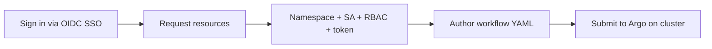
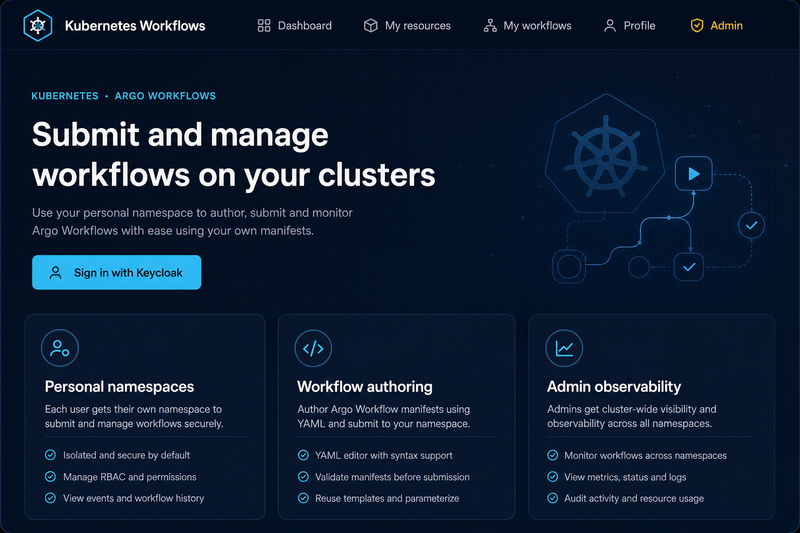
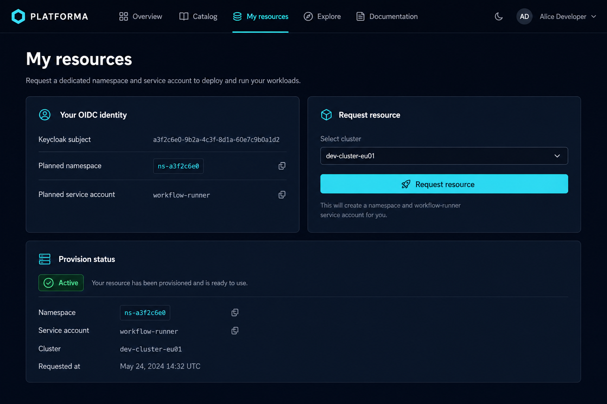
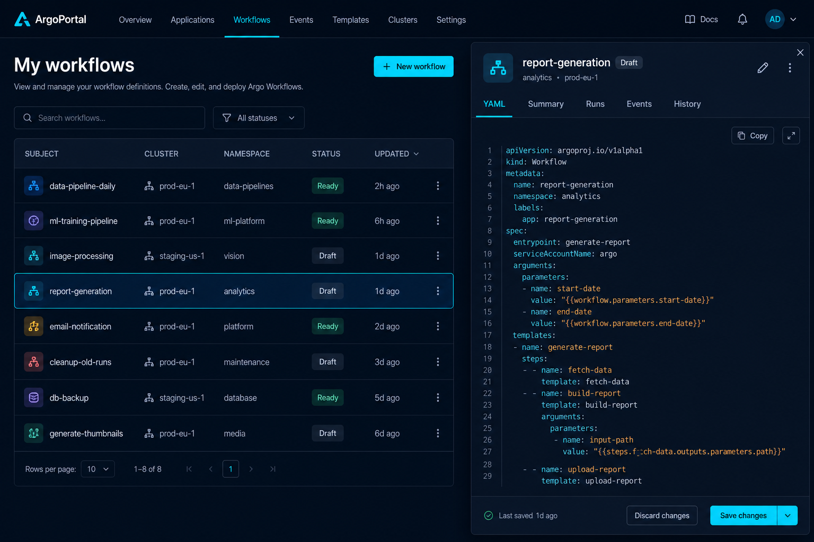
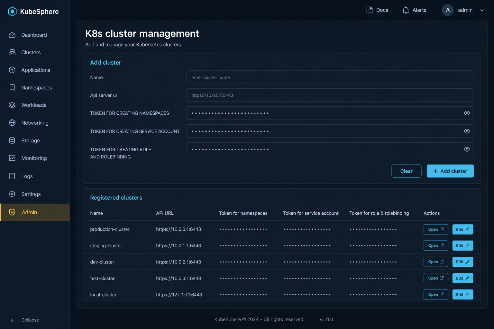
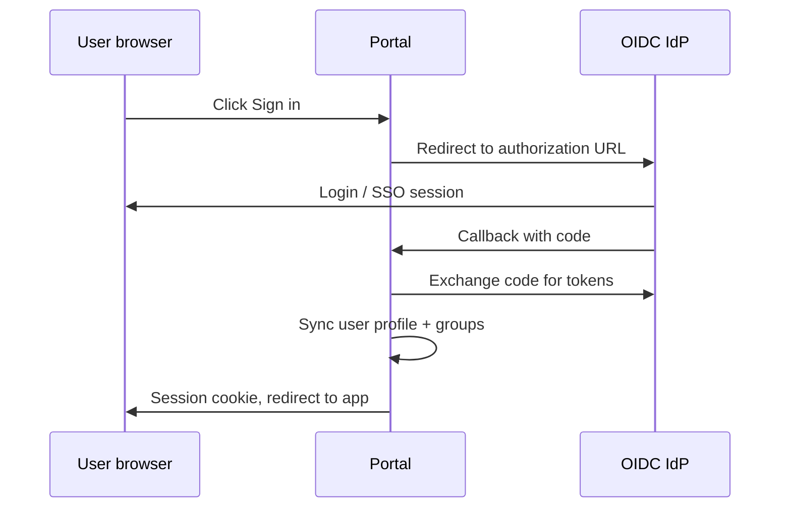

# Kubernetes Argo Workflows — platform guide

Visual overview of the portal: who it is for, how users move through it, and what each main screen does.

> **Illustrations** in this guide are **UI mockups** for documentation. They match the app’s layout and branding but are not live screenshots. Your running instance may differ slightly as the UI evolves.

> **Development and testing only.** Do not use in production without a full security review.

## At a glance

**Kubernetes Argo Workflows** is a web portal that connects **OIDC SSO** (e.g. Keycloak, Okta, Microsoft Entra ID) to **Argo Workflows** on Kubernetes. Each user can receive an isolated namespace, a `workflow-runner` service account, Argo RBAC, and a personal token to submit workflows from the browser.

| Layer | Role |
|-------|------|
| **Identity (OIDC SSO)** | Users sign in through your IdP; no passwords stored in the portal |
| **Portal (Django)** | Provisions resources, stores workflow YAML, submits to the cluster API |
| **Kubernetes + Argo** | Runs workflows in per-user namespaces |

---

## User journey

1. **Sign in** — browser redirect to your OIDC provider (SSO).
2. **Request resources** — pick a cluster; the portal creates namespace, SA, and Argo Role/RoleBinding.
3. **My workflows** — save Argo `Workflow` YAML tied to your namespace.
4. **Submit** — portal uses your stored service account token to create the workflow on the cluster.

---

## Home page

Landing page for signed-in and anonymous users. Highlights personal namespaces, workflow authoring, and admin observability.

**URL:** `/`

| Element | Purpose |
|---------|---------|
| **Sign in with Keycloak** | Starts OIDC SSO (button label follows your IdP in dev) |
| **Personal namespaces** | Each user gets dedicated cluster resources |
| **Workflow authoring** | Store and submit Argo manifests |
| **Admin observability** | Cluster and user management for IdP `admin` group |

After sign-in, quick links go to **My workflows**, **My resources**, and **Dashboard**.

---

## My resources

Where users request and view their Kubernetes footprint on a registered cluster.

**URL:** `/my-resources/`

| Section | What you see |
|---------|----------------|
| **Your OIDC identity** | Keycloak `sub`, planned namespace name (from `sub`), planned `workflow-runner` SA, Argo role names |
| **Request resource** | Select cluster → creates namespace, SA, `argo-workflows-role`, RoleBinding, and personal token |
| **Existing provisions** | Status (Active / Failed), step-by-step provision log, optional token reveal |

**What gets created on the cluster**

| Resource | Name pattern |
|----------|----------------|
| Namespace | Sanitized OIDC `sub` |
| Service account | `workflow-runner` |
| Role | `argo-workflows-role` |
| RoleBinding | `argo-workflows-rb` |

---

## My workflows

Author and manage Argo Workflow YAML scripts. Submission uses your active provision and personal service account token.

**URL:** `/my-workflows/`

| Element | Purpose |
|---------|---------|
| **New workflow** | Subject, cluster, namespace (from provision), Argo `Workflow` YAML |
| **Your workflows** | List of scripts with status Draft / Ready |
| **Submit** | Creates a `Workflow` object on the cluster via the Kubernetes API |

Manifests must be valid Argo `Workflow` resources (`apiVersion: argoproj.io/v1alpha1`, `kind: Workflow`).

---

## Admin — cluster management

Restricted to users in the IdP **`admin`** group (e.g. Keycloak group `admin`).

**URL:** `/control/clusters/`

| Task | Where |
|------|--------|
| Register a cluster | **Add cluster** form at top of cluster list |
| Bootstrap tokens | From [`k8s/cluster-bootstrap/install.sh`](../k8s/cluster-bootstrap/install.sh) |
| Test connectivity | **Open** → cluster explorer (namespace list) |
| Admin home | `/control/` — user stats, links to clusters and workflow observability |

See [cluster bootstrap README](../k8s/cluster-bootstrap/README.md) for the field-by-field token mapping.

---

## Admin panel overview

**URL:** `/control/`

| Stat / link | Description |
|-------------|-------------|
| Total users | Django users synced from OIDC |
| K8s clusters | Registered clusters |
| Workflows | User-authored workflow scripts |
| **Manage clusters** | API URLs and provisioner tokens |
| **Browse workflows** | Cross-user workflow observability |
| User table | Links to per-user OIDC profile and resource provisions |

---

## Authentication flow

Users never enter passwords into the portal. Sign-in is always **OIDC SSO**:

Supported IdP examples: **Keycloak**, **Okta**, **Microsoft Entra ID**, **Google Cloud Identity**, **Auth0**, and other OIDC-compliant servers.

Details: [README — Secure authentication](../README.md#secure-authentication-oidc-sso)

---

## Page reference

| Page | URL | Who |
|------|-----|-----|
| Home | `/` | Everyone |
| Dashboard | `/dashboard/` | Signed-in users |
| Profile | `/profile/` | Signed-in users |
| My resources | `/my-resources/` | Signed-in users |
| My workflows | `/my-workflows/` | Signed-in users |
| Admin panel | `/control/` | IdP `admin` group |
| Cluster management | `/control/clusters/` | IdP `admin` group |
| Cluster explorer | `/control/clusters/<id>/` | IdP `admin` group |
| User detail | `/control/users/<id>/` | IdP `admin` group |

---

## Related documentation

- [README](../README.md) — install, Docker Compose, requirements, OIDC setup
- [Cluster bootstrap](../k8s/cluster-bootstrap/README.md) — Kubernetes RBAC and token extraction
- [Preparing a cluster](../README.md#preparing-a-kubernetes-cluster) — end-to-end cluster onboarding

---

## Replacing mockups with real screenshots

To use actual screenshots from your environment:

1. Run the portal locally (`uv run python manage.py runserver` or Docker Compose).
2. Capture PNGs of each page (same URLs as above).
3. Replace files under `docs/images/` keeping the same filenames, or update paths in this guide.

Recommended capture order: Home (logged out), My resources (after provision), My workflows, Control → Clusters.
